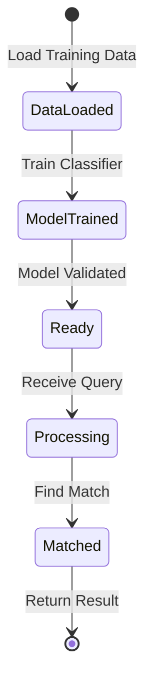

# State Flow - Query Matcher

## Business State Diagram

## State Definitions
- **DataLoaded**: Training data loaded from YAML file
- **ModelTrained**: ML model trained on examples
- **Ready**: System ready to accept queries
- **Processing**: Analyzing customer query
- **Matched**: Category and topic identified

## Transitions
- **Load Training Data**: Read YAML file, parse categories/topics/examples
- **Train Classifier**: Vectorize text, train simple ML model (TF-IDF + classifier)
- **Model Validated**: Check training accuracy meets threshold
- **Receive Query**: Accept customer input string
- **Find Match**: Apply model to predict category+topic
- **Return Result**: Output matched category and topic with confidence